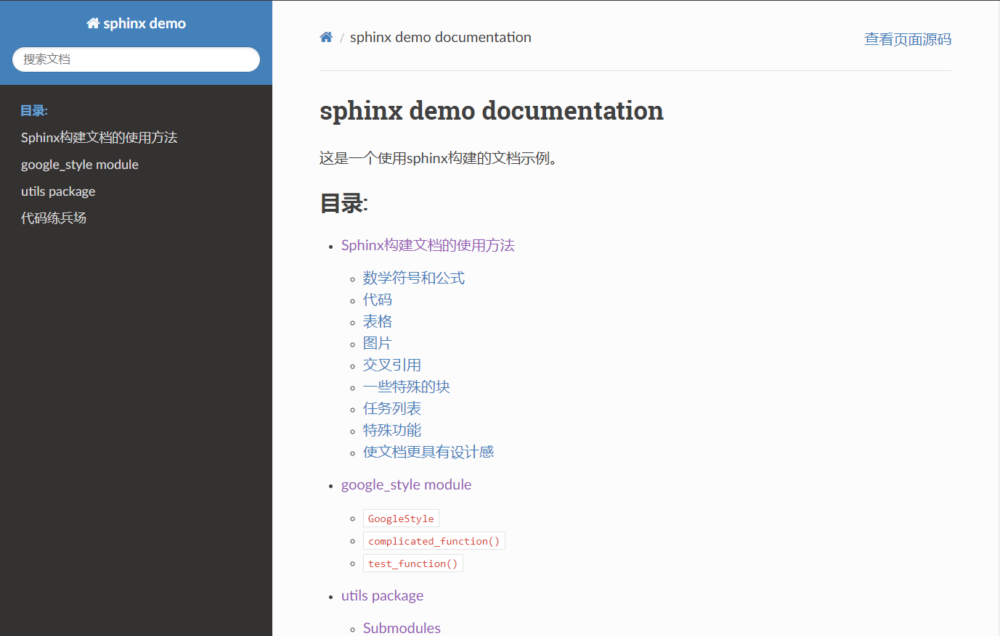
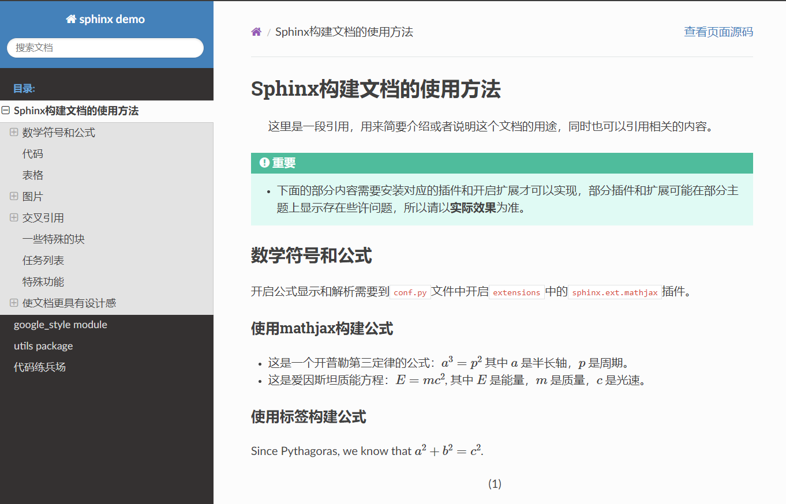
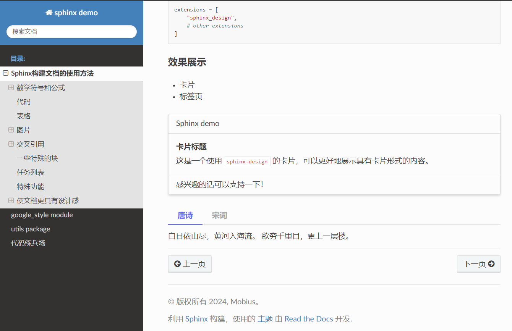
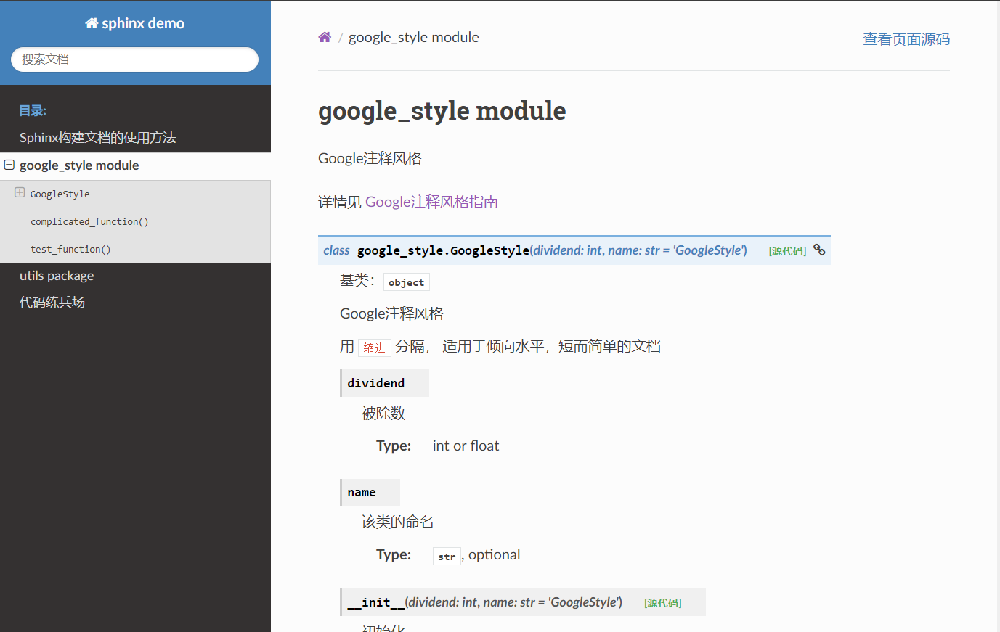

# Shpinx Demo

> 这是一个用于演示sphinx的demo程序

## 效果展示









为了确保环境的一致性，建议通过conda或者venv创建虚拟环境

python版本为 Python 3.9.18

### 使用venv
```bash
python -m venv .venv    # 创建虚拟环境

activate                # 激活虚拟环境

pip install -r requirements.txt # 安装依赖
```

### 使用conda
```bash
conda create -n sphinx python=3.9.18    # 创建虚拟环境

conda activate sphinx    # 激活虚拟环境

pip install -r requirements.txt # 安装依赖
```

### 清华源安装
如果直接安装速度慢或者不成功，可以使用清华园进行安装

- 临时切换清华源
```bash
pip install -r requirements.txt -i https://pypi.tuna.tsinghua.edu.cn/simple
```

- 永久切换清华源
```bash
pip config set global.index-url https://pypi.tuna.tsinghua.edu.cn/simple
```

## 修改了代码之后需要重新生成文档
```bash
cd doc
sphinx-apidoc -o source ../src
make html
```

```bash
Traceback (most recent call last):
  File "C:\ProgramData\Anaconda3\lib\runpy.py", line 197, in _run_module_as_main
    return _run_code(code, main_globals, None,
  File "C:\ProgramData\Anaconda3\lib\runpy.py", line 87, in _run_code
    exec(code, run_globals)
  File "C:\Users\Mobius\Desktop\sphinx_demo\.venv\Scripts\sphinx-autobuild.exe\__main__.py", line 7, in <module>    
    sys.exit(main())
  File "C:\Users\Mobius\Desktop\sphinx_demo\.venv\lib\site-packages\sphinx_autobuild\__main__.py", line 54, in main 
    watcher = RebuildServer(watch_dirs, ignore_handler, change_callback=builder)
  File "C:\Users\Mobius\Desktop\sphinx_demo\.venv\lib\site-packages\sphinx_autobuild\server.py", line 27, in __init__
    self.paths = [os.path.realpath(path, strict=True) for path in paths]
  File "C:\Users\Mobius\Desktop\sphinx_demo\.venv\lib\site-packages\sphinx_autobuild\server.py", line 27, in <listcomp>
    self.paths = [os.path.realpath(path, strict=True) for path in paths]
TypeError: realpath() got an unexpected keyword argument 'strict'
```

### 解决方法

直接进入到\.venv\lib\site-packages\sphinx_autobuild\server.py

修改代码将, strict=True 删除，得到如下形式

```python
self.paths = [os.path.realpath(path) for path in paths]
```

以上就是一个小小的demo，用于演示如何使用sphinx构建文档，如何组织文档。

这里面还包括几个内容需要自己去处理的：

1. 如何组织好的index.rst文件
2. 如何编写更好的注释，需要了解Google,Numpy,rst等注释风格。


